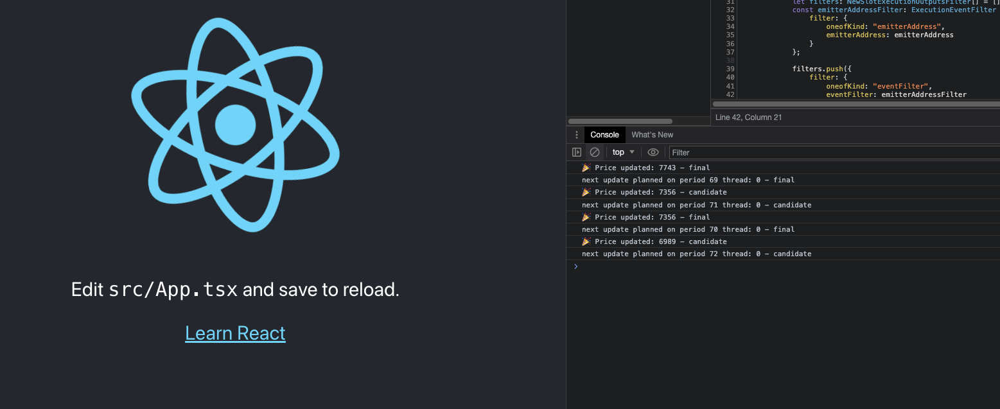

# Get Massa slot events with GRPC-react

## Configuration

update in `App.tsx` :

- `GRPC_URL` with url of your massa node GRPC server
- `EMITTER_ADDRESS` with the address of the emitter

We need unidirectional streaming from the server to operate.

Massa node should be on this branch : <https://github.com/massalabs/massa/tree/grpc_web_stream>

Update the node config in `config.toml` :

- grpc.grpc.public.accept_http1 = true
- grpc.grpc.public.enable_cors = true

## Example

### With Autonomousprice massa example

1. Deploy the SC <https://github.com/massalabs/massa-sc-examples/blob/main/autonomousprice/contracts/assembly/contracts/autonomousprice.ts> on massa blockchain

    -> `'Contract deployed at address: AS12gWWfmXgT7HSZ8kc6syJbQA5EnDreggGRjwjSfYnR8jeL3tYU4'`
2.
    - Update `GRPC_URL`
    - Update `EMITTER_ADDRESS` with sc address : AS12gWWfmXgT7HSZ8kc6syJbQA5EnDreggGRjwjSfYnR8jeL3tYU4
3. Start this app

    ```sh
    npm run start
    ```

4. Start your web browser

    
